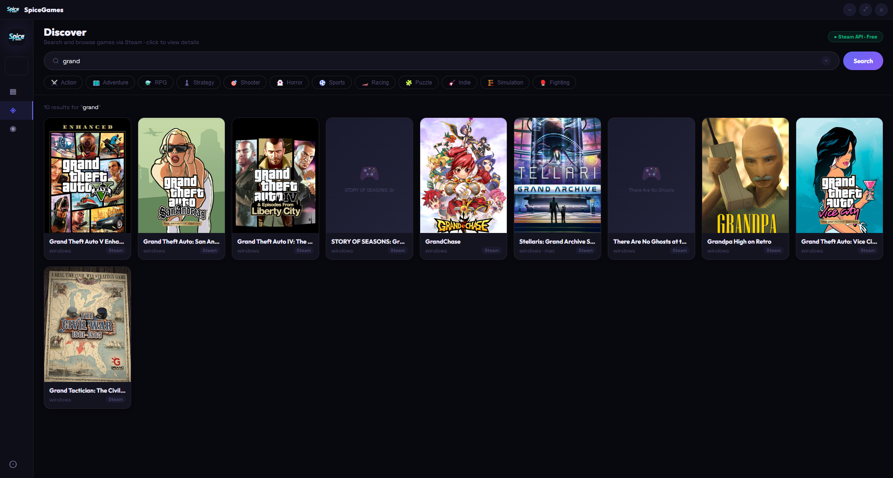
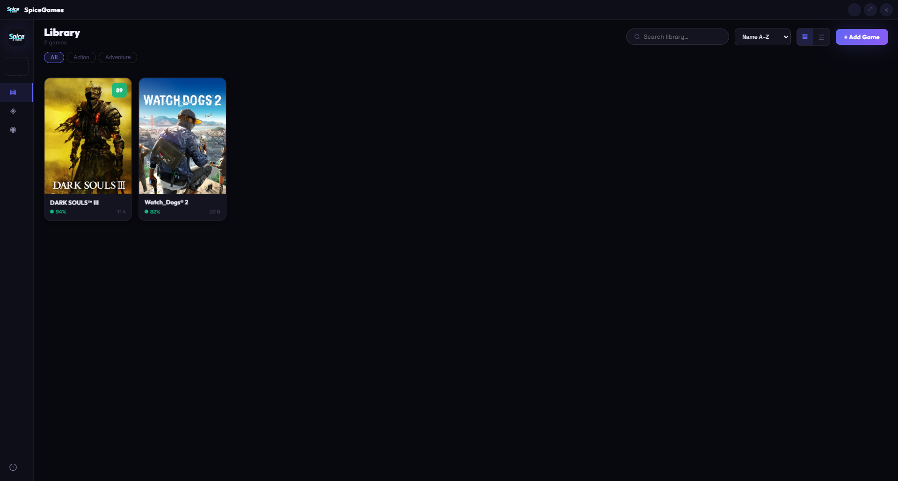

# 🎮 SpiceDeck

**A game launcher that actually works**

Just feed it your games and launch them. Organize your library, track playtime, find deals, discover new stuff. No account required. No weird tracking. Just you and your games.

 

 

[⬇ Download](https://github.com/ash-kernel/spicedeck/releases) • [Features](#-features) • [Screenshots](#-screenshots)

---

## What you can do

| Feature | What it does |
|---|---|
| **Library** | Add .exe files, launch 'em, import from Steam |
| **Smart Covers** | Auto-magic game covers, ratings, completion times |
| **Track Playtime** | See how many hours you've sunk into each game |
| **Collections** | Favorites, Playing, Backlog — organize your way |
| **Discover** | Browse tons of games by genre |
| **Find Deals** | See deals from Steam, Epic, GOG, Humble — with search |
| **Game News** | News from PC Gamer, IGN, and others |
| **Share Card** | Create shareable game cards with your library |
| **Storage Manager** | Monitor disk usage and find large games |
| **Extras** | Input tester, screenshots, widget mode, 9 themes |

Everything works offline. No accounts. No tracking.

---

## 📸 Screenshots

🏠 Your Game Library

*All your games in one place with covers, ratings, and playtime*

📊 Stats & Info

*How many hours you've played and what you're into*

---

## ⬇ Download

[Windows Installer](https://github.com/ash-kernel/spicedeck/releases/download/stable/SpiceDeck.Setup.exe)

All versions available here: https://github.com/ash-kernel/spicedeck/releases

---

## ⚠️ SmartScreen Warning

Windows might warn you the app is unsigned. Don't worry — just click **More info → Run anyway**. It's totally safe.

> im not rich to get licensed 

---

## 🔒 Privacy

No accounts. No tracking. No analytics. Your game library stays on your computer. That's it.

---

Made by [ash-kernel](https://github.com/ash-kernel)

